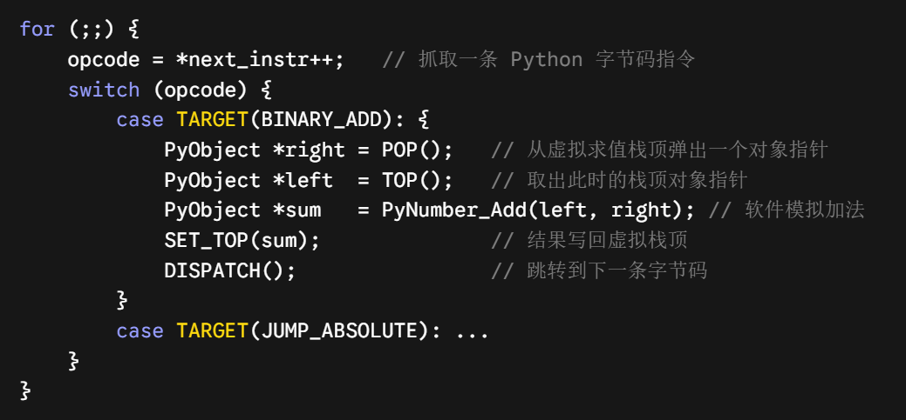
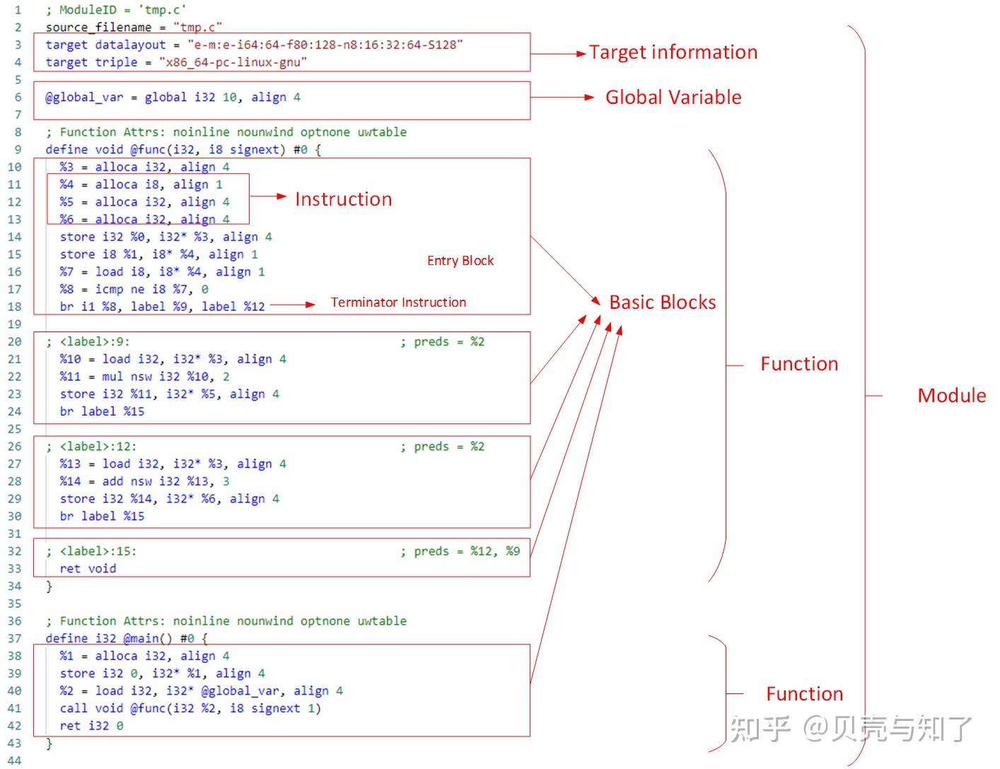
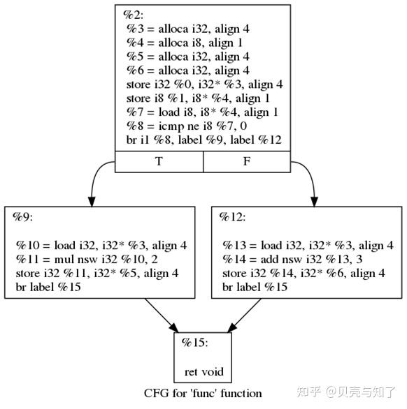
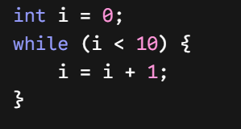
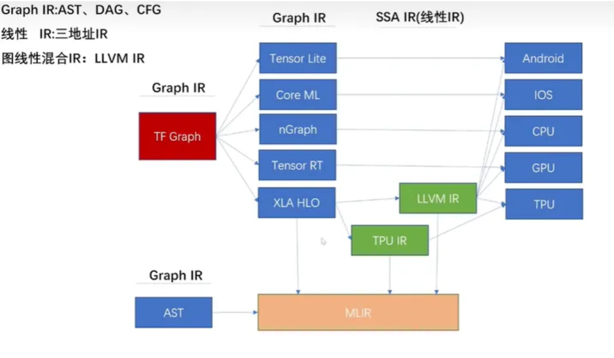
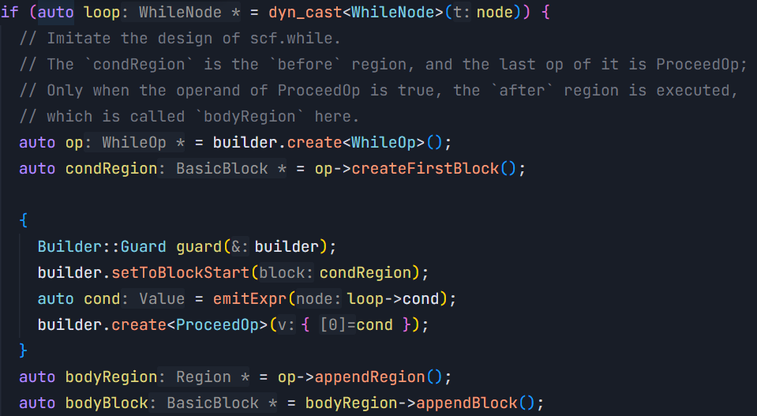
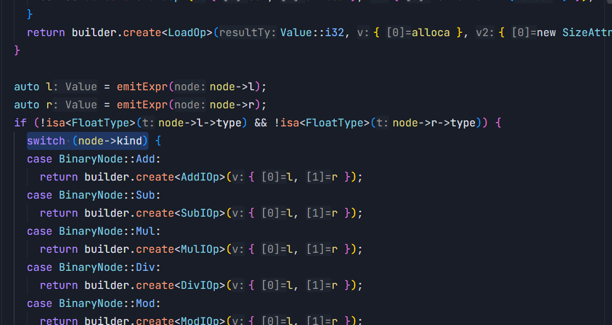
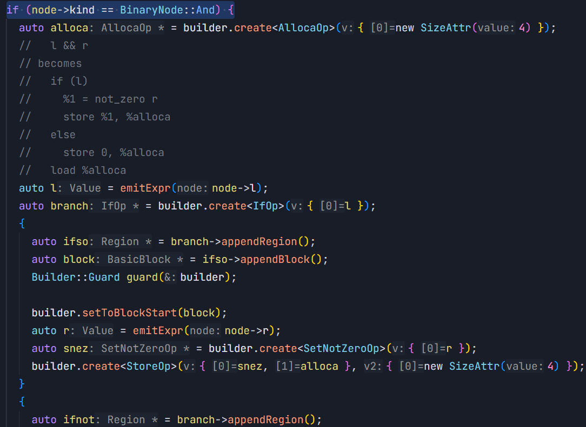
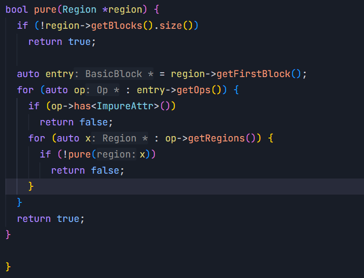
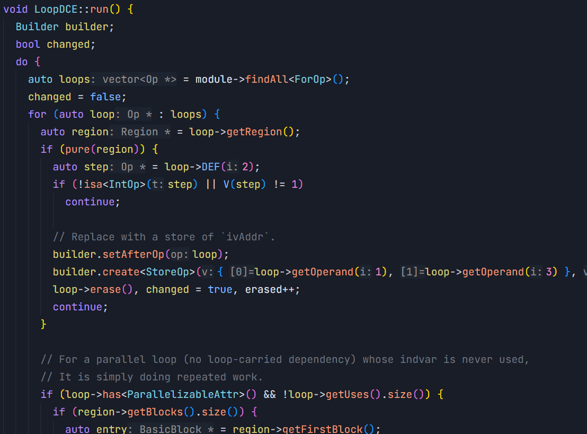

# TASK0

## 1. 编译器和解析器的区别？JIT 和 AOT 区别？链接器又是什么？请你在文档之中叙述一下 C 语言需要经过几个步骤被转换到机器代码

### 编译器 Compiler 和解释器 Interpreter 的区别

**Compiler**（例如 GCC、Clang），将源码经过前、中、后端、汇编、链接，输出目标 CPU 可直接执行的机器码。在程序运行时，二进制指令可直接进入内存，CPU 的指针直接执行。

- 优点：可以做**全局优化**。
- 缺点：产物绑定具体的目标 ISA 与 ABI（对齐方式等也随之固定），所以无法**跨平台**直接复用；同时编译的时间会很长。（m+n：m 种前端与 n 种后端叠加出的组件规模）

**Interpreter**，本身是一个编译（指 .c → .exe）好的二进制程序，比如 CPython，是一个**状态机**；也就是说，compiler 由操作系统的加载器直接映射到虚存空间，物理 CPU 的指令指针（PC）直接在这个空间里取指，而 interpreter 是用数据结构等**模拟出了一个 CPU**。

例如 `c = a + b;`，编译器输出 CPU 的指令为 `%() = add %xa %xb`，解释器会从栈顶取出对象，判断数据类型，在堆上构建结构体（包含引用计数、类型指针），最后把结果在内存中返回。

### JIT 与 AOT 的区别

**JIT**（just in time，即时编译）仍以 interpreter 启动，检测到某点调用了多次（**热点检测**），则会编译为机器码写入缓冲区，下一次执行 CPU 的 PC 指针会直接跳入这一段执行。

**AOT**（ahead of time）则是上述的**静态编译**，如 compiler。

### 链接器（Linker）

**链接器**，也就是 .o → .exe 这一步，.o 引用的外部函数和全局变量的内存地址会被占位符或空缺替代，这一步就是把**符号解析**、**地址重定位**，把数据段、代码段拼接到统一虚拟地址空间。

### 以 cpp 为例：C 语言从源码到机器码的步骤

1. **预处理**：所有以 `#` 开头的宏定义展开、条件编译筛选、头文件全部嵌入，输出 `.i`。
2. **编译**：词法语法语义分析构建 AST，经 IR 优化，最后映射为特定芯片（在后端因架构而不同）的汇编代码文本 `.s`。
3. **汇编**：汇编助记符等通过查表转译为 ISA，输出 `.o`。
4. **链接**：如上述链接器部分，符号解析，重定位地址偏移，打包静态库与运行时启动代码，输出最终可执行文件 `.exe`。

## 2. GCC 和 LLVM 在架构上面的区别？为什么 LLVM 的架构更加清晰

GCC 的前中后端**高度交织**，充满全局的宏定义与依赖的屎山。LLVM 则是以**库为中心**的正交设计，前中后端**解耦**，LLVM 的核心组件全部以 C++ 动态库、静态库形式封装，IDE 可以直接把 LLVM 等作为第三方库安装。

第二点是如上述 m+n 所述，将 m×n 的复杂度大大降低，即**新的语言只需要增加一种前端，新的架构只需要增加一种后端**。

## 3. 解释一下视频中提到的 LLVM IR 的相关特性，包括但不限于 SSA、PHI 函数、CFG（Module/Function/BasicBlock/Instruction 等）、Pass、Value/Use/User、TypeSystem、CFG 遍历与侵入式链表等

### LLVM 的内存层级

LLVM 内存层级如图所示，包括从大到小的 module—function（参数列表、属性，包括多基本块）—basicblock（单入口单出口的指令序列）—instruction（原子操作）。

### SSA（静态单赋值）

1. 每个变量仅被赋值一次（**def**）。
2. 每个变量在被使用前已被定义（**use**）。

意义：使数据流分析的复杂度大大降低为 O(1)。

### PHI 函数

**phi 函数**：如下图，SSA 在 if-else 的判断中（形如 `%8 = icmp ne i8 %7, 0`）进行分叉，两个分支给出了同一个变量的不同定义，汇合点无法用“单个定义”来指代它；phi 函数的意义就是在汇合点按**前驱块**静态地选出对应的值，形如 `%i_phi = phi i32 [ %i0, %Pre_header ], [ %i1, %Body ]`——从 `%Pre_header` 进来取 `%i0`，从 `%Body` 进来取 `%i1`。 phi 本身没有运行时语义：它在寄存器分配前就被消解为**在前驱块末尾插入的 move**（必要时分裂关键边），那种运行时选择是 **select / CMOV** 的行为。

### use-def / def-use 链

见下图，假设：循环前 `%pre` 块生成 `%i0 = 0`，循环体 `%whi` 块 `%i1 = add %i_phi, 1`，在循环内外会生成 `%i_phi = phi i32 [ %i0, %Pre_header ], [ %i1, %Body ]` 的 phi 函数，但是 `%i1` 此时还并没产生，就会借助 **use-def 链**建立指向 `%i1` 的指针对象占位，等到生成时便顺利闭环。

借上述例子，use-def 和 def-use 链，也就是我依赖谁可以算，我计算后触发谁，在中端优化的时候，例如常量折叠 `%.20 = mul i32 %.4, %.1` 时，其中 `%.4`、`%.1` 等均为 value，假设发现 `%.4` 和 `%.1` 是常量的时候，可以根据 use-def 需求链取下两个参数，将指令替换为常数。def-use 假设 `%.1` 产生，并维护了 `%.17 = sub i32 %.1, 1`，`%.20 = mul i32 %.4, %.1`，即为 **def-use 链**。由此，从一个 Use 取到它的 User、或从一个 Value 取到它的第一个 user/def 都是 **O(1)**（`Use::getUser()`、`use_begin()`），不必扫描整份 IR；但要把一个 Value 的**全部**使用者或定义者遍历完仍然是 **O(k)**（k 为该 Value 的 use 数）——链条消除的是“全 IR 扫描的 O(N)”，而不是把遍历本身变成 O(1)。

### 从 AST 到 SSA IR 的中端流程

前端输出了 AST 进入中端，先经过如 AST Lowering / IRGen，变为了非 SSA 的 IR（通过 alloca、load、store 驻留栈内存），然后经过 **Mem2Reg Pass** + 支配树等（后续中端中会答到）变为规范的 SSA 的 IR，再经过表达式消除、死代码剔除、TailE、循环优化等等 pass 局部提取 **DAG**，最后输出精炼的 IR 进入后端，IR 全程保持 CFG 状态。

如上述，优化不是一步到位的，依旧遵循着**模块化**，在第一步 AST 转化为 IR 的过程中，**TypeSystem** 便是在这步，剥离了数据类型，转化为了对应位宽的比特类型，指针地址比对便可审查数据类型是否匹配。

### 侵入式链表

传统容器（`List<Node[prev, next]>` ───（指针寻址）───► `Instruction`）、`std::vector`、`std::list<Instruction>` 等等会有时间复杂度高（前者为 O(n)），或是在内存建堆等引发 CPU 未命中缓存的概率大大升高。**侵入式链表**则会把外围的 prev、next 嵌入在数据内，这样创建时本身作为链表元素，**无额外内存开销**，且任意点改变的时间复杂度均为 O(1)。

### Pass 遍历 CFG 的方式

- **RPO（逆后序遍历）**：先对 CFG 进行深度优先搜索（DFS）记录离开节点的顺序（后序），再将其完全倒序。可以验证分析所有输入的数据后计算出值的可否。
- **PO（后续遍历）**：沿着 CFG 的箭线从汇合点逆流而上。验证下游是否使用过某个指令来决定增删。
- **支配树**：沿着支配树从根节点向下递归。保证了在父节点可见的变量定义在整个子树作用域内安全可用。

## 4. 数据流中 User 的实现一般等同于 CFG 控制流中的什么结构？

数据流中的 **User**在实现上一般就落在 **Instruction** 上。

## 5. 解释一下前中后端的流程，以及对应流程的主要工作是什么

`.cpp` 进入前端，经过词法分析拆为 token、语法分析构建 AST，语义分析检查 AST；前端在 AST Lowering / IRGen 阶段把 AST 降为**非 SSA 的 IR**，进入中端后，再由分析 pass、转换 pass（如 **Mem2Reg + 支配树**）把它规范成 **SSA 形式的 IR**；后端经过五个 superpass 输出 `.s`（指令选择、寄存器分配前调度、寄存器分配、寄存器分配后调度、栈帧构建与代码发射）。

## 6. （拓展）请你调研一下常见的在 LLVM IR 上进行优化的 Pass 有哪些，这些 Pass 的功能都是什么（在 LLVM IR 层级简单举例进行叙述）？至少五个

**Mem2Reg**：识别只被 load 和 store 操作的局部 alloca 指令；通过计算 CFG 的支配边界，插入 phi 节点；利用重命名栈（将离散的 load 替换为最新版本的 SSA 寄存器）。

**InstCombine**（窥孔代数简化）：逐条匹配代数恒等式与常量模式，做常量折叠、恒等元与吸收元消去、幂等化简及结合律重排；新产生的指令重新入队直至不动点，并统一指令的规范形式以放大其他优化。

**DCE / ADCE**（死代码消除）：DCE 删除无使用者且无副作用的指令；ADCE 则以 ret、br、store、call 等为活根，沿 use-def 反向传播活跃性，删除到不了活根的指令链与不可达基本块。

**SCCP**（稀疏条件常量传播）：借 SSA 的 use-def 图在 undefined → constant → overdefined 的格值上做稀疏传播；条件一旦确定就折叠分支、剔除不可达边对应的 phi 操作数，让控制流信息反过来推导数据流上的常量。

**TRE**（尾递归消除）：识别结果被直接 ret 返回的自调用，把参数改写为 phi 节点、尾调用改写为跳回循环头的回边，在返回可转发的条件下把递归深度由 O(n) 降为 O(1)。

## 7. 什么是 MLIR？MLIR 与传统 LLVM IR 的区别是什么？

传统 LLVM IR 是**扁平 CFG**。它向上承接 C、C++ 等过程式语言，向下对接 CPU、GPU 汇编。它的原子单位是“标量指令（add, load, br）+ 扁平控制流（BasicBlock）”。MLIR 将中间表示的抽象层级从“单一固定层（LLVM IR）”扩展为“**连续可自定义谱系**”，允许高层图计算、张量运算、多重循环与底层机器指令在同一个基础设施中共存。LLVM IR 由于扁平 CFG 把高层信息过早抹平，会**过早丢失语义**（仿射循环边界、张量形状、作用域结构等在降级后不可恢复），使多面体优化、循环变换等失去约束而退化为 **NP 难问题**；同时也会难以映射到 NPU 等非标准硬件上等等。

## 8. （拓展）MLIR 的核心结构（包括但不限于 Dialect、Operation、Region、Block、Value、OpOperand、BlockOperand、OpResult、BlockArgument、Attribute）？

### 框架

- **Dialect 命名空间**：逻辑模块划分的基石。它是一组相关的 Operation、Type（类型）和 Attribute（属性）的集合。
- **Operation（Op）**：MLIR 的最小语义单位。每个 Operation 都带有全局唯一的字符串全称（如 `arith.addi`、`scf.for`）。一个 Op 拥有零个或多个操作数（Operands）、结果（Results）、属性（Attributes），以及内嵌的区域（Regions）。
- **Region（区域）**：嵌套容器的桥梁。Region 挂载在 Operation 内部，它持有并管理一个或多个 Block，比如一个 `scf.if` 操作可以通过其内部的两个 Region 分别存放 then 和 else 的控制块。
- **Block（基本块）**：顺序执行的基本单元。与 LLVM 的 BasicBlock 类似，Block 由一条条 Operation 顺序串联而成，且最后必须是一条终结操作（Terminator）。

### 数据流

- **Value**：代表参与数据流运算的实体。在 MLIR 中，Value 只有且必须是以下两种角色之一：OpResult 或 BlockArgument。
- **OpResult（操作产出值）**：Operation 计算完成后产生的值。与传统 LLVM 指令最多产出一个值不同，MLIR 的 Operation 支持多返回值（例如一个矩阵分解算子可以同时产生 3 个 OpResult 作为独立的 Value）。
- **BlockArgument（块参数）**：挂载在 Block 入口处的参数。它统一了“函数形参”与“分支汇合”。
- **OpOperand（操作数引用）**：连接 Operation 与被消费 Value 的指针边（对应 LLVM 的 Use 概念）。它构成了从使用者指向定义者的 Use-Def 依赖。
- **BlockOperand（块跳转引用）**：终结操作中专门用于指向目标 Block 的指针边（如 `cf.br ^bb2` 中的 `^bb2`）。

### 元数据

- **Attribute（属性）**：附加在 Operation 上的编译期已知常量元数据。

## 9. （拓展）MLIR 之中的数据流和 LLVM IR 中的数据流是一样的吗？如果是一样的话，请你对应二者相关的数据流概念

如上述数据部分，**OpOperand** 对应 LLVM 的 **Use-Def 依赖链**，在 MLIR 中，Value 只有且必须是以下两种角色之一：OpResult 或 BlockArgument，其中，MLIR 的 Operation 支持多返回值作为独立 value，**BlockArgument** 对应 **phi 函数**。

## 10. （拓展）详细分析 MLIR 与 LLVM IR 之间控制流相关概念的区别与相似之处

LLVM IR 为**平坦控制流**，复杂的操作都会被降维成为基本块之间的有向跳转边。MLIR 为**分层嵌套与多级控制**，MLIR 将控制流解耦为两层：高层保留具有严格作用域、语义完整的**结构化控制流**；在降级到最终码前，才退化为与 LLVM IR 等价的**平坦 CFG**。

## 11. （拓展）MLIR 采用什么结构代替 PHI 函数？这种结构相比 PHI 函数有什么好处？这种结构还能统一 LLVM IR 之中什么结构？

### 替代结构：BlockArgument + 分支的块操作数

MLIR 用 **BlockArgument（块参数）** 配合**分支终结操作携带的块操作数**来代替 PHI 函数：每个 Block 的入口可以声明一组参数，而分支终结符（如 `cf.br ^bb2(%x, %y)`、`scf.cond_br`）在跳转时把值直接“传参”给目标块。于是汇合点不再需要反向列举“我从哪条边来、每条边带什么值”，而是由前驱在跳转处显式给出。

### 相比 PHI 函数的好处

1. **语义局部化**：PHI 要求一个块同时列出**全部前驱**以及每条边对应的值，块必须“知道自己有多少前驱”；块参数把传值写在**跳转处**，新增或删除一条 CFG 边只需要改一条跳转指令，改动是局部的。
2. **没有并行赋值语义的坑**：LLVM 同一基本块内的多条 PHI 是**并行赋值**的，正确性依赖额外规则（例如交换两个变量时必须借助临时值）；块参数只是普通的值绑定，天然不存在这个问题。同时 MLIR 会校验所有前驱传入的操作数**数量与类型一致**，便于验证。
3. **不再依赖支配关系书写**：PHI 的操作数必须支配对应的前驱边，隐含地与支配树绑定；块参数把值的传递变成显式的 SSA 边，内联、提升、降级等变换的写法更统一。
4. **天然适配嵌套与结构化控制流**：块参数与 Region 的嵌套结构契合，`scf.for` 的 `iter_args`、`scf.while` 的循环携带值都可以用同一套机制表达，不必先把结构化控制流降级成扁平 CFG。
5. **可扩展性更好**：一个 Op 可以有多个 Region、每个 Region 可以有多个 Block，块参数机制不依赖“单一函数入口”的假设，能承载比函数更复杂的抽象层级。

### 它能统一 LLVM IR 中的什么结构

它统一了 LLVM IR 中原本相互独立的两种结构：**函数形参（Function Argument）** 与 **PHI 节点**。在 MLIR 里这两者都是 BlockArgument——函数入口块的 BlockArgument 就是函数形参，循环与分支入口块的 BlockArgument 就是原来 PHI 承担的角色。

## 12. （拓展）下述给出的特等奖源码中，是如何基于 MLIR 思想实现自己的高层 IR 的？请你自行学习 MLIR Scf Dialect、Func Dialect、Arith Dialect，分析作者第一层 IR 是否是兼容 scf Dialect 的，并分析源码之中作者基于第一层高层 IR 做了哪些优化，这些优化的作用是什么，请你举例说明

如作者所述，这里是仿照的 `scf.while` 的设计，**WhileOp** 内部挂载了两个独立的 **Region**，一个用于判定一个用于循环，不同的是作者这里终结符用的是手搓的 `proceedop`（见注释）

这里对应的是 `arith.addi/addf`（整型和浮点型）、`subi` 等，这一步确定了 **语义**

**Builder** 维护了一个全局唯一的写入游标（构造时：自动备份当前外层 builder 的 bb 和 at。）。如果不使用 **Guard**，当代码“钻入”ifso 区域后，外部的上下文信息就会丢失。

综上所述，虽然是借用的 MLIR 的思想，但是仍然使用的是 llvmir 的 `alloca` 等，且并不是规范的 mlir 格式（比如上文作者自己定义的 `proceedop` 等），正如作者所言，由于每个 Op 仅能返回一个值，我无法实现类似 `scf.yield` 的内容。

优化部分见 `pre-opt`，如下图举例所示

这一步是 **递归判定区域**，判定 `<ImpureAttr>`，如果有嵌套循环或分支，直接递归扫描子 Region

这一步开始循环消除了。