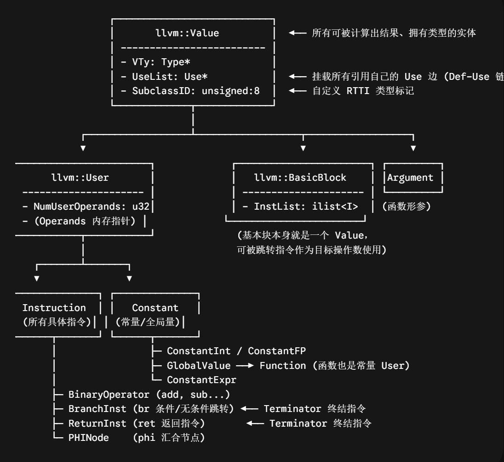
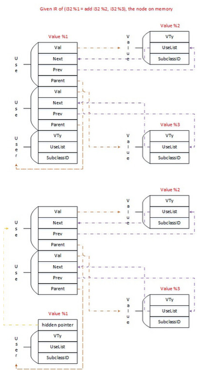
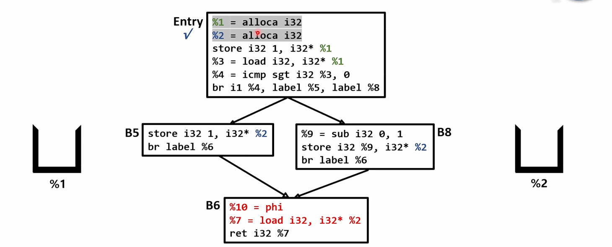

1.TypeSystem是如何实现的？简述TypeSystem使用的设计模式

Typesystem原理为静态约束与位宽几何解释，依赖llvmcontext的生命周期管理与value的ptr体系。而设计模式分为享元模式，工厂方法模式，组合模式和自定义RTTI。

其中享元模式的类型对象全局不可变且唯一，类型的等价只需要比较指针。

工厂方法模式将type及其派生类的所有构造函数设为private/protexted，杜绝直接的new type()，接口都收敛为静态工厂接口，拦截重复创建请求，命中缓存则返回享元指针。

组合模式基类提供统一多态接口，容器内行内部递归嵌套子类型type*，统一语法描述嵌套数组/结构体。

RTTI启用C++高开销的dynamic_cast，在type基类头部显示内嵌typeID(8位)，一次内存读取和整数比对即可类型安全向下转换。

2.画出Value/Use/User的类关系，CFG关系

3.在出题人的项目之中采用的支配树算法是什么？另外请你了解一下 Lengauer-Tarjan Dominators Algorithm(可以阅读下面GPT5.0编译器的源码)，解析二者算法流程并对比优劣

采用的是SemiNCA算法，LT算法(Lengauer-Tarjan Dominators Algorithm)查集完sdom后，通过维护桶排序和两阶段延迟求值来求得idom，而NCA将直接支配者改用NCA树上爬升。
用我所学来说，都是先在DFS生成树分配DFSNum，避免了暴力求解的E*V复杂度，然后LT通过dfn比较寻找半支配者，然后通过两难判定定理确定直接支配者idom，(1.sdom1=sdom2->直接支配者 2.dfn(sdom1) < dfn(sdom2)->支配者->继续上述)，为避免第二种情况未找到派生出的解法，采用桶排序延迟清算，引入 std::vector<unsigned> bucket[v]。先把依赖关系挂在桶里暂存。直到外层循环推进到树的浅层、算出了更高层节点的 idom 之后，再通过正序遍历把真实指针回填。这导致代码需要维护大量的辅助桶数组。
NCA则放弃方案一二的分类，将问题降维为“局部树上最近公共祖先”的问题，先逆DFS求半支配者，再顺DFS利用NCA方程直接求解idom。

4.请你再次深入探索PHI函数，分析LLVM IR中PHI的强大作用，探究在编译器数据流优化中发挥的作用
1.将内存操作转为了SSA。2.当程序沿CFG执行时，在汇合块时应当消费那一个分支块的数据在编译期时是未知的，因此phi函数充当了一个以“执行流来自哪个前驱基本块”为选通信号的纯数据流开关，避免了跨分支数据传递时候需退化成的内存上的操作。3.后续pass可通过分析phi函数进行进一步优化（比如循环递归等）.具体phi函数的插入如下题所述。

5.请你查询相关资料，阅读出题人的项目，分析Mem2Reg流程，并详细分析迭代支配边界和Live集合在PHI函数插入中发挥的作用
IDF（迭代支配边界）计算汇合块，Live分析汇合之后变量还是否存活，假如不经过IDF,Live计算，会产生大量无用phi，只有IDF则会产生大量死phi。如下图所述，Mem2Reg在进入重命名时，通过IDF计算汇合块并先插入phi空壳，并为每一个待提升的 alloca 分配了一个独立的变量值栈，遇到 store %val, %ptr，说明产生了新值，将 %val 压入 %ptr 对应的栈顶，并让本块的压栈计数++，load 执行 top() 查看栈顶并替换load，遇到phi函数时，补充一半的phi函数，走完了后回溯并出栈，在支配树上执行回滚，当从另一边到达相同汇入块时，便补全了phi函数的另一半，同时Live分析汇合后LiveInBlocks不为空，即变量存活。
