## 1. TypeSystem 是如何实现的？简述 TypeSystem 使用的设计模式

TypeSystem 原理为静态约束与位宽几何解释，依赖 LLVMContext 的生命周期管理与 value 的 ptr 体系。而设计模式分为享元模式、工厂方法模式、组合模式和自定义 RTTI。

其中享元模式的类型对象全局不可变且唯一，类型的等价只需要比较指针。

工厂方法模式将 type 及其派生类的所有构造函数设为 `private/protected`，杜绝直接的 `new type()`，接口都收敛为静态工厂接口，拦截重复创建请求，命中缓存则返回享元指针。

组合模式基类提供统一多态接口，容器内部递归嵌套子类型 `type*`，统一语法描述嵌套数组/结构体。

RTTI 规避 C++ 高开销的 `dynamic_cast`，在 type 基类头部显式内嵌 typeID（8 位），一次内存读取和整数比对即可类型安全向下转换。

## 2. 画出 Value/Use/User 的类关系，CFG 关系

## 3. 在出题人的项目之中采用的支配树算法是什么？另外请你了解一下 Lengauer-Tarjan Dominators Algorithm（可以阅读下面 GPT5.0 编译器的源码），解析二者算法流程并对比优劣

采用的是 SemiNCA 算法。LT 算法（Lengauer-Tarjan Dominators Algorithm）并查集求完 sdom 后，通过维护桶排序和两阶段延迟求值来求得 idom，而 NCA 将直接支配者改用 NCA 树上爬升。

用我所学来说，都是先在 DFS 生成树分配 DFSNum，避免了暴力求解的 E*V 复杂度；然后 LT 通过 dfn 比较寻找半支配者，然后通过两类判定情形确定直接支配者 idom（1. `sdom1 = sdom2` → 直接支配者；2. `dfn(sdom1) < dfn(sdom2)` → 支配者 → 继续上述）。为避免第二种情况未找到派生出的解法，采用桶排序延迟清算，引入 `std::vector<unsigned> bucket[v]`，先把依赖关系挂在桶里暂存；直到外层循环推进到树的浅层、算出了更高层节点的 idom 之后，再通过正序遍历把真实指针回填。这导致代码需要维护大量的辅助桶数组。

NCA 则放弃方案一二的分类，将问题降维为“局部树上最近公共祖先”的问题，先逆 DFS 求半支配者，再顺 DFS 利用 NCA 方程直接求解 idom。

## 4. 请你再次深入探索 PHI 函数，分析 LLVM IR 中 PHI 的强大作用，探究在编译器数据流优化中发挥的作用

1. 将内存操作转为了 SSA。
2. 当程序沿 CFG 执行时，在汇合块时应当消费哪一个分支块的数据在编译期时是未知的，因此 phi 函数充当了一个以“执行流来自哪个前驱基本块”为选通信号的纯数据流开关，避免了跨分支数据传递时候需退化成的内存上的操作。
3. 后续 pass 可通过分析 phi 函数进行进一步优化（比如循环递归等）。具体 phi 函数的插入如下题所述。

## 5. 请你查询相关资料，阅读出题人的项目，分析 Mem2Reg 流程，并详细分析迭代支配边界和 Live 集合在 PHI 函数插入中发挥的作用

IDF（迭代支配边界）计算汇合块，Live 分析汇合之后变量还是否存活。假如不经过 IDF、Live 计算，会产生大量无用 phi；只有 IDF 则会产生大量死 phi。如下图所述，Mem2Reg 在进入重命名时，通过 IDF 计算汇合块并先插入 phi 空壳，并为每一个待提升的 alloca 分配了一个独立的变量值栈；遇到 `store %val, %ptr`，说明产生了新值，将 `%val` 压入 `%ptr` 对应的栈顶，并让本块的压栈计数 `++`；`load` 执行 `top()` 查看栈顶并替换 load；遇到 phi 函数时，补充一半的 phi 函数，走完了后回溯并出栈，在支配树上执行回滚，当从另一边到达相同汇入块时，便补全了 phi 函数的另一半。同时 Live 分析汇合后 LiveInBlocks 不为空，即变量存活。

## NewPassManager

### 出题人的项目是如何构建中端 Pass Pipeline 的？

首先，流水线容器（`std::vector<std::unique_ptr<PassInterface<IRUnitT, AnalysisManagerT>>> Passes;`）可以看出这里是扁平的顺序，记录所有被注册进的 pass，其中下标即为执行的时间顺序。根据 PassBuilder，先注册了支配树和循环分析，然后创建 MPM，若 -O0 则返回空的 MPM，若为 -O1/-O2，则按照 Mem2Reg、LoopSimplify、LCSSA 及 LocalGVN、LICM 组成的教学 pipeline。

### CRTP 设计模式，这种设计模式的好处是什么？

CRTP 即一个派生类将自身作为模板参数，传递给其基类模板。

1. 函数调用时，会引入内存解引用等延迟，CRTP 可使之直接跳转，也便于内联优化。
2. 自动注入 PassID。

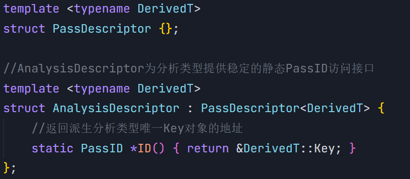

### 类型擦除

类型擦除在不强制显性继承特定虚基类的前提下，擦除具体类型信息，将异构对象的生命周期和行为统一封装，使能够安全存入运行时的同质容器。这种也称外部多态模式。

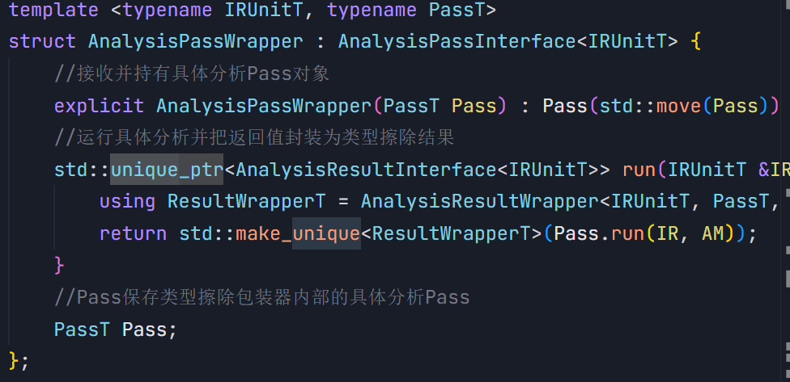

### 出题人项目源码之中 PassID 这个空类的作用是什么？

`struct alignas(8) PassID {};` 采用了地址即身份和强类型安全标记的设计模式，满足 analysisPass 必须声明的一个静态成员变量，保证了唯一性和身份识别无额外开销；与 `using PassID = void*` 相比，避免了隐式指针降级，同时定义了独立的类型 PassID，避免了非法指针侵入；同时强制八字节对齐了内存。

### AnalysisPass 注册的作用？项目中是如何实现注册的？

1. 函数都为惰性计算，不会需要所有的分析结果，注册表便满足了显式调用时分析才会执行。
2. 注册支配树后，后续 pass 调用支配树的时候，避免了反复建树，将查询时间复杂度控制在了 O(1)。
3. 分析管理器可以捕捉调用时的依赖有向边。

在 PassBuilder 期，pass 以上述类型擦除和 CRTP 的模式存入注册表。

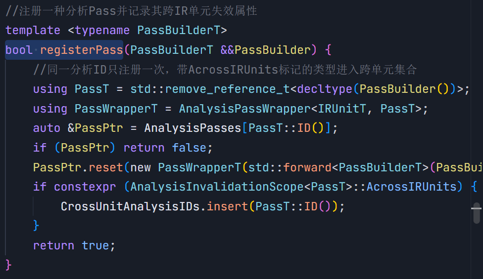

### 分别分析 TransformPass/AnalysisPass 调用的整个流程

AnalysisPass：一开始赋予 PassID 并注册入 Passes，当 `AM.getResult<PassT>(IR)` 时，使用 `{PassID*, IRUnitT*}` 二元组作为 CacheKey，若缓存命中，直接解引用 `ResultCache[Key]`。如果分析 A 的计算需要依赖分析 B，如需要支配树的时候，采用栈式拦截，如下图。

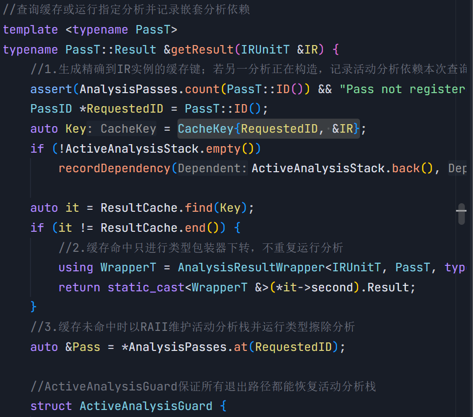

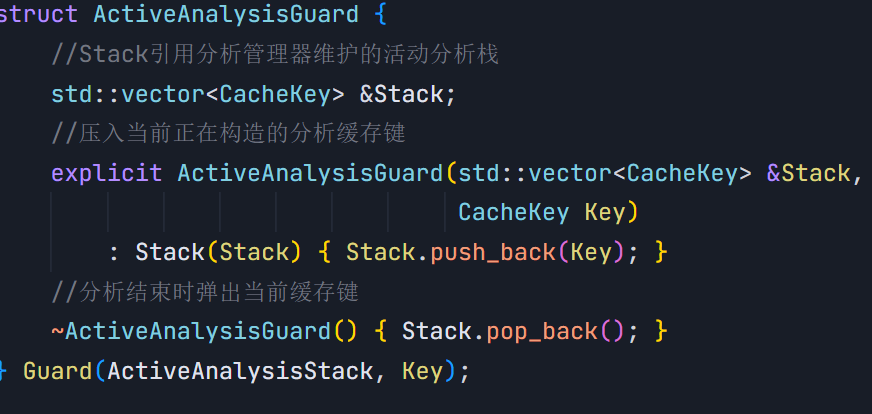

TransformPass：利用多态模式进行参数适配，在 passmanager 中如图所示开始执行，执行具体 pass，根据契约执行缓存失效和结合结果。还可通过跨层级桥接作用域 module 和有界不动点迭代规避无效 IR 遍历。

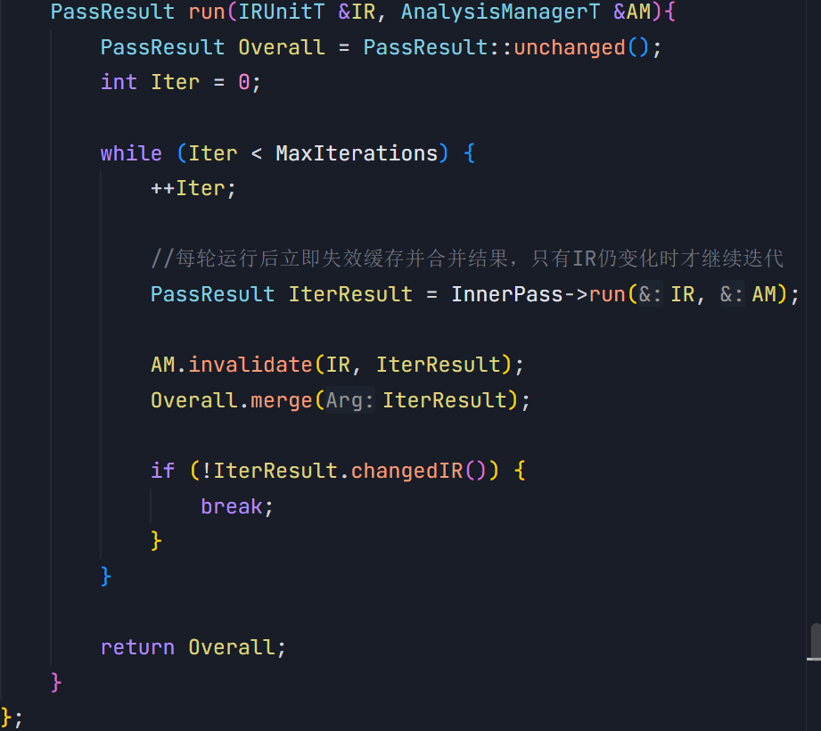

### **（拓展）**如果你感兴趣，请阅读 LLVM 相关 NewPassManager 源码，探寻自动失效机制

1. 每个 transformpass 结束后均以数据结构承诺其变异边界，构成自动失效的输入条件，如图所示。

   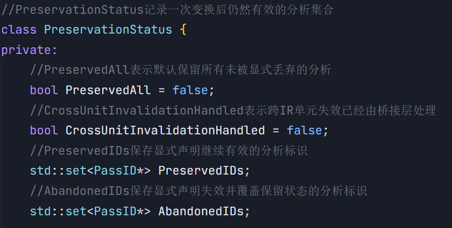

2. 如下图，p1 探测接口，p2 分流，p3-4 当低阶基础分析失效后，其上的高阶分析级联失效。

   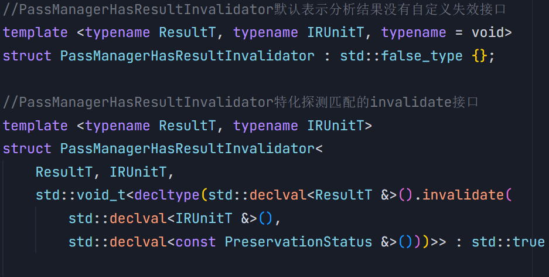

   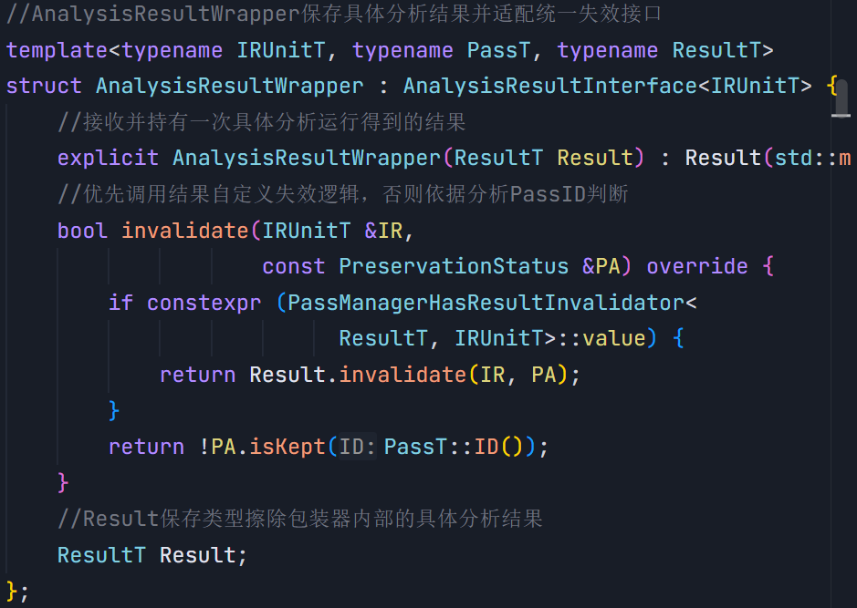

   

   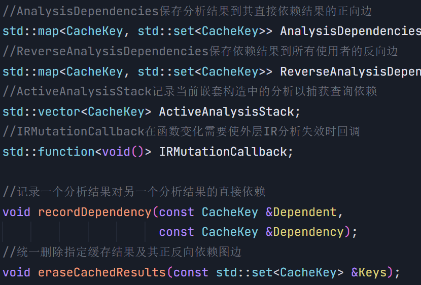

README.md的任务完成：

1.阅读LoopInfo，LoopSimplify，LCSSA等循环规范化pass，分析什么是循环规范形态，画出这几个pass在控制流和数据流优化前后的对比图

源码的生成的CFG往往及其混乱，直接在此基础上进行优化往往也及其复杂，所以必须执行循环规范化，分为控制流规整和数据流封闭两个阶段。从下图LoopInfo.hpp(或LoopSimplify.hpp)将自然循环收敛为具有唯一预头、唯一锁存块和专用出口的标准形态。

   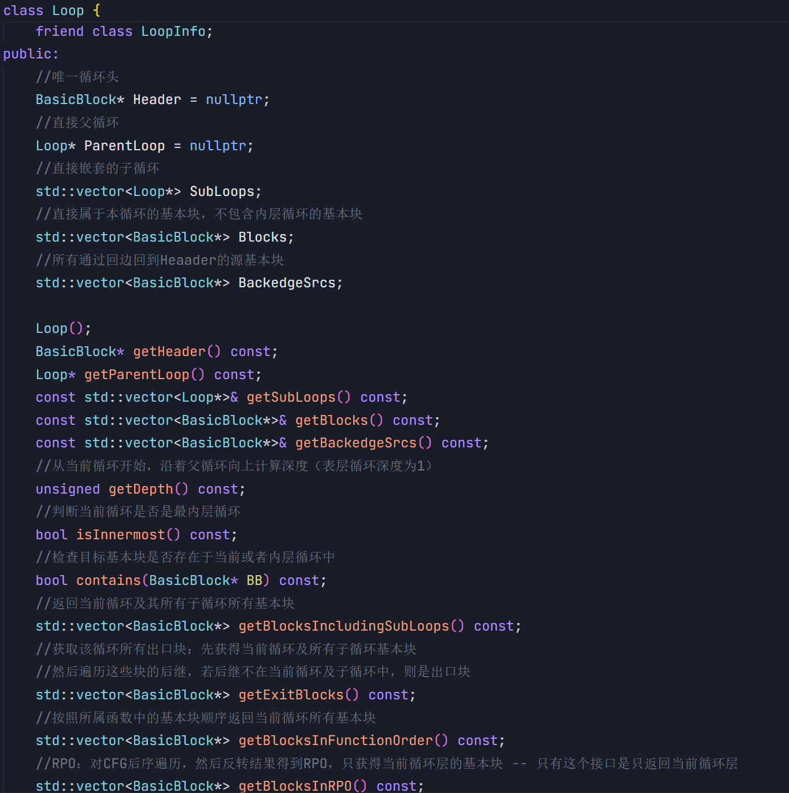

   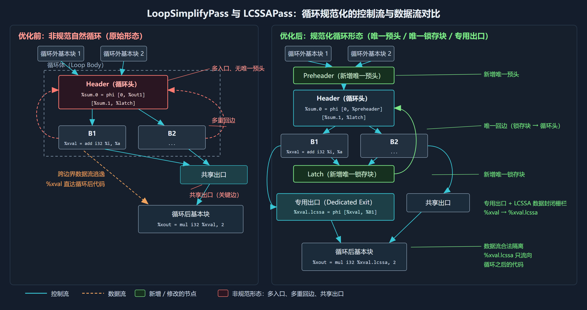

## 多面体相关

### 1. 什么是仿射变换？

即“线性映射 + 平移”，形如 `f(x) = A·x + b`，`A` 为常数整数矩阵，`b` 为常数整数向量。多面体模型要求循环的三要素都仿射：迭代域（循环边界为迭代变量与符号参数的仿射函数，构成整数多面体）、访问函数（数组下标仿射，`A[B[i]]` 这类间接下标出局）、调度 `θ(i) = T·i + t`。正因为三者仿射，变换后的迭代域与依赖仍是多面体，依赖退化为仿射丢番图方程，可用整数线性规划精确求解。循环交换、反转、倾斜 `(i,j) → (i,j+αi)`、分块 `i → (⌊i/B⌋, i mod B)` 都是仿射变换。

### 2. 多面体循环优化是解决什么类型的循环并行问题的？请你了解一下循环展开，分析多面体优化与循环展开所针对的循环类型的不同之处

多面体循环优化针对的是两重以上的嵌套循环，例如卷积等，而循环展开针对的是扁平的循环。
SCoP，多面体优化处理的是静态控制部分中的紧嵌套 for：边界与下标均为仿射函数，如矩阵乘、Jacobi 等稠密循环核，依赖距离是常量或仿射式，可以在编译期精确判定。它在不违反依赖的前提下，重排序与划分整个迭代空间：无依赖则 do-all 完全并行。

循环展开则是把循环体复制 k 份，省掉循环控制开销，暴露指令级并行与 SLP 向量化，不要求循环仿射（while、指针间接访问都能展开），但它不改变迭代执行顺序，携带依赖距离 d < k 时副本之间仍须串行，换不到循环级并行，代价是代码膨胀与寄存器压力。多面体决定迭代空间重排的上限，展开只是填充流水线，二者常配合使用（Polly 变换后仍由 LoopUnroll/向量化收尾）。

