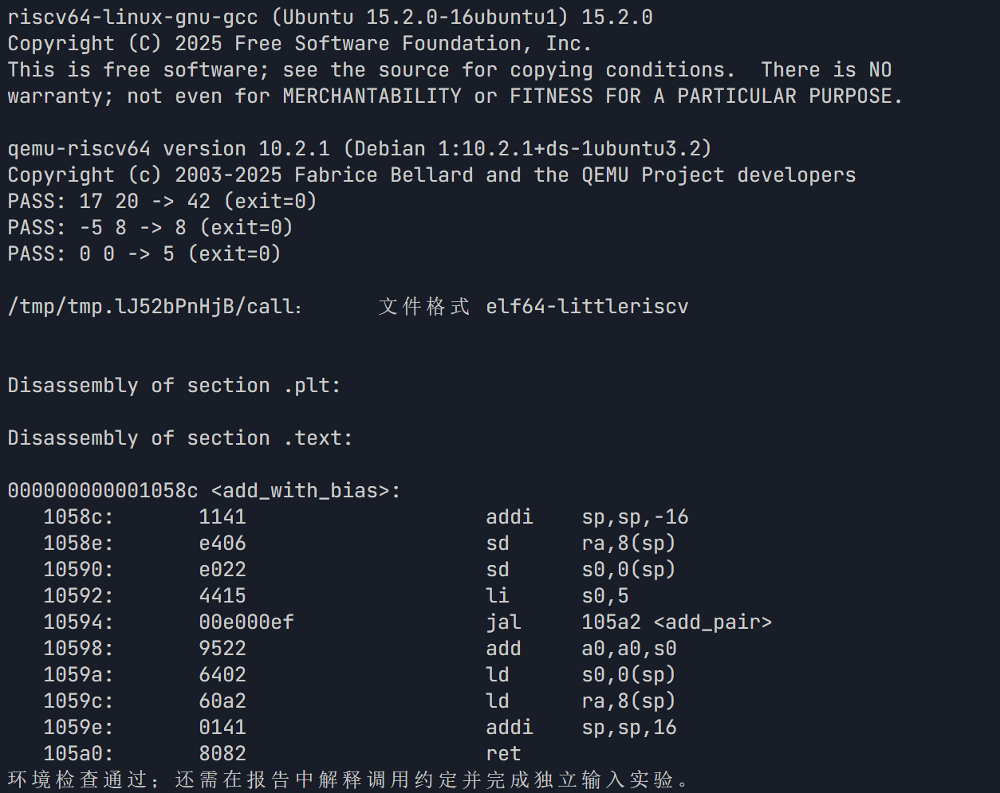
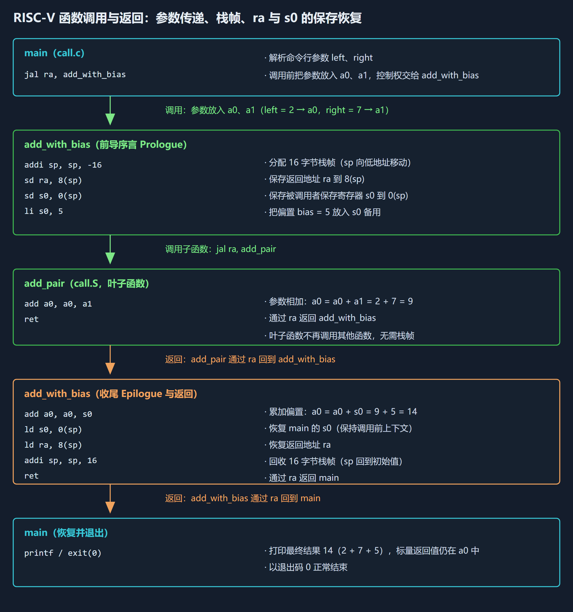
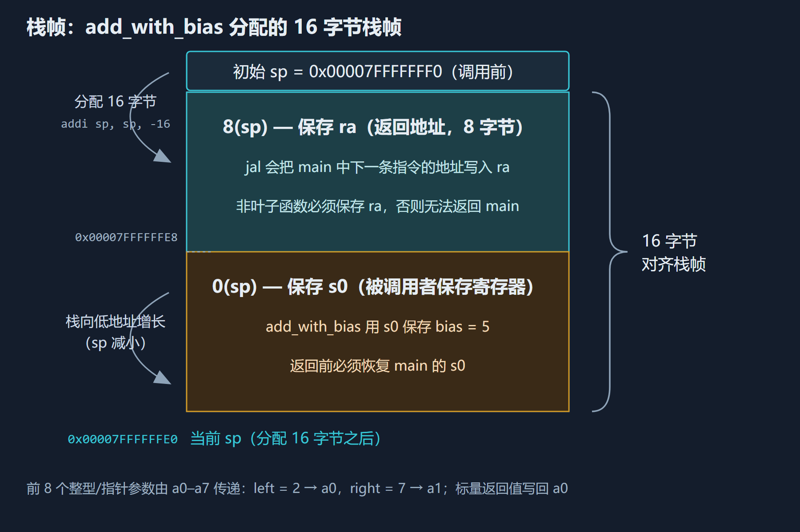
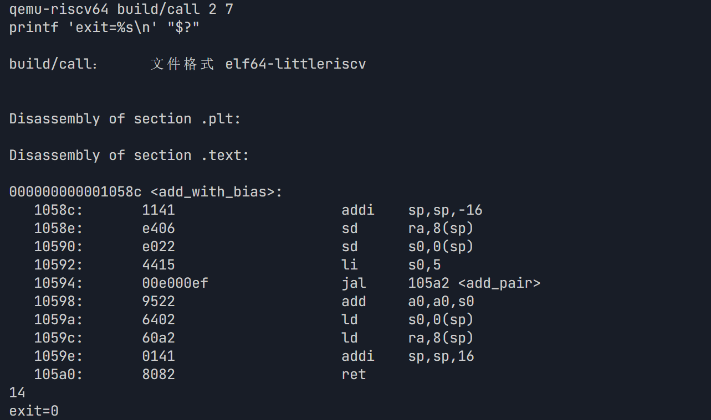
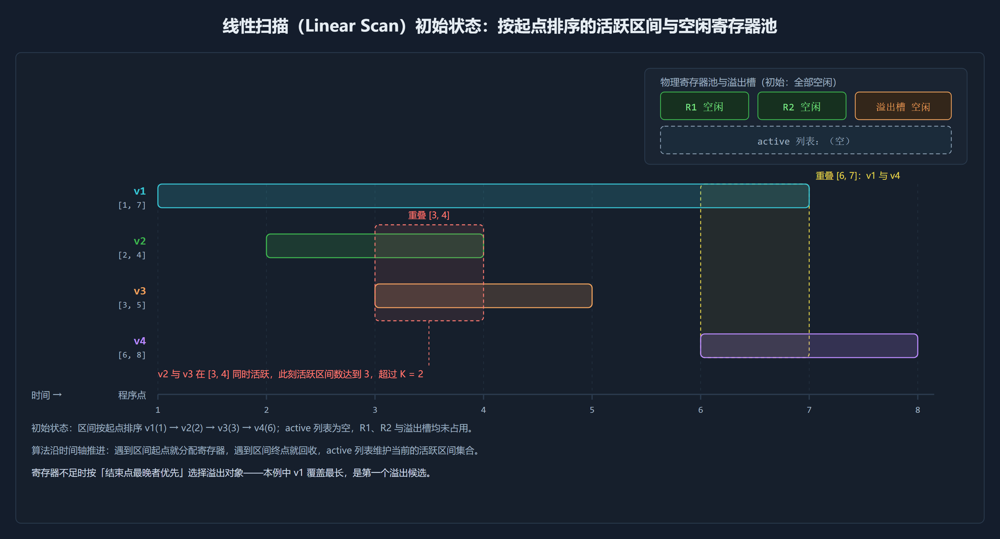
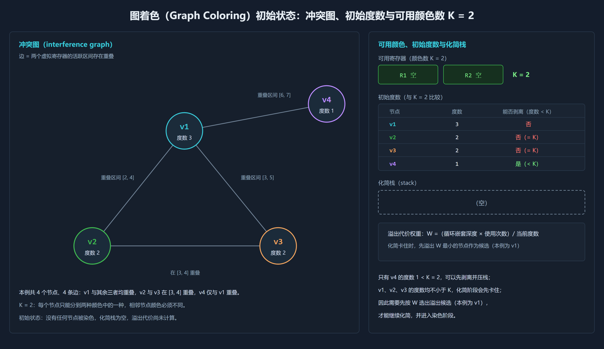

# task3：RISC-V 函数调用、栈帧与寄存器分配

## 1. 环境检查

记录工具版本、三组输出与退出码。

## 2. 调用链与栈帧

阅读 `examples/call.c` 和 `examples/call.S`，画出 `main → add_with_bias → add_pair` 调用链和 `add_with_bias` 的栈帧。

## 3. 反汇编对照解释

对照反汇编解释：两个参数和返回值在哪些寄存器中；为什么保存 `ra`、`s0`；谁负责保存 caller-saved / callee-saved 寄存器；为什么栈帧分配 16 字节；恢复顺序和 `ret` 的作用。区分伪指令与反汇编结果，指令地址和编码不要求一致。

- **参数与返回值**：函数调用的前 8 个整型/指针参数由硬件寄存器 `a0` 到 `a7`（x10–x17）直接承载。在此例中，`left = 2` 位于 `a0`，`right = 7` 位于 `a1`。规范约定标量返回值使用 `a0`，`add_pair` 将部分和存入 `a0`，随后 `add_with_bias` 在 `a0` 基础上完成累加，最终使最终值 `14` 依旧驻留在 `a0` 中，返还给外层的 `main` 函数。
- **栈帧与 16 字节**：栈帧是在运行时内存的栈段中，为单个函数调用动态分配的私有内存区域。它由 `sp`（栈指针）限定当前边界，自高地址向低地址扩展。这里 16 个字节的空间全部用于保护调用约定规定的 `ra` 与 `s0` 寄存器（各八字节）。
- **谁负责保存寄存器**：caller 由 `a0`–`a7`、`t0`–`t6`、`ra` 保存，callee 由 `s0`–`s11`、`sp` 保存。
- **恢复顺序与 `ret`**：本例序言是 `addi sp, sp, -16`、`sd ra, 8(sp)`、`sd s0, 0(sp)`，尾声就必须严格倒着来：先 `ld s0, 0(sp)`，再 `ld ra, 8(sp)`，然后才 `addi sp, sp, 16` 抬高栈指针，最后 `ret`。顺序不能颠倒，一是这几条 `ld` 都要从当前 `sp` 指向的帧里取数，如果先执行 `addi sp, sp, 16`，帧就已经被释放，`ra` 和 `s0` 都取不回来了；二是 `ra` 只有到 `ret` 真正要用它的时候才可以恢复，所以它必须排在倒数的位置。`ret` 是伪指令，展开后是 `jalr x0, 0(ra)`，也就是按 `ra` 里保存的返回地址跳回调用者，同时把本该写进链接寄存器的返回地址写进恒为零的 `x0` 丢弃掉，函数到此结束、控制权交还给 `main`；叶子函数 `add_pair` 没有自己的栈帧，一条 `ret` 就够了。
- **伪指令与反汇编**：伪指令是汇编器为了照顾人类程序员的阅读与编写直觉，所提供的一套语法糖助记符，比如语法中的 `ret`、`li`。反汇编器线性扫描 ELF 文件代码段（`.text`）中的原始机器字节，按照 ISA 的硬件译码规则，将其逆向解析为具体的物理指令文本。
- **地址与编码为何不同**：链接脚本、静态链接的 C 运行时排布在 `.text` 前面的初始化引导指令长度、工具链版本差异，都会导致指令地址不同；RVC、寄存器分配自由度、伪指令展开路径差异都会导致编码不一致。

## 4. 独立输入验证

自选一组不同于脚本的、小范围有符号整数输入，先手算 `left + right + 5`，再运行验证并记录结果。说明如果把 `s0` 换成 caller-saved 临时寄存器，跨调用保存值需要什么条件。

> 独立输入：`2, 7`；手算结果 `14`（2 + 7 + 5）；运行结果一致，`passed`。

仍然需要 8 字节作为溢出槽位：跳转之前需要 `sd t0, 0(sp)` 推入栈内存，跳转后再 `ld t0, 0(sp)` 将其从栈内存中重新加载出来。（我认为可以 call 后直接 `li t0, 5` 或者 `addi a0, a0, 5`，反倒节省时钟周期。）

## 5. 寄存器分配

解释虚拟寄存器、物理寄存器、活跃区间和 spill；任选线性扫描或图着色，用一个小例子说明寄存器不足时如何分配。

- **虚拟寄存器**：编译器内部数据结构中的抽象符号标号（如 `%0`、`%1`）。
- **物理寄存器**：CPU 的物理布线的硬连线高速 SRAM 存储单元（如 RISC-V 中的 `a0`–`a7`、`t0`–`t6`、`s0`–`s11`）。
- **活跃区间**：一个变量从第一次被定值的程序点开始，到最后一次被使用的程序点结束，在时间轴上所覆盖的离散或连续指令区间。
- **溢出（Spill）**：当在某个执行时间切片内，同时处于活跃状态的虚拟寄存器数量超过了物理可分配的上限时，硬件物理寄存器无法容纳所有活跃变量。

小例子：设可分配的物理寄存器数 `K = 2`，四个虚拟寄存器的活跃区间为 `v1 [1, 7]`、`v2 [2, 4]`、`v3 [3, 5]`（在 `[3, 4]` 与 `v2` 产生重叠）、`v4 [6, 8]`。

### 5.1 线性扫描

1. 推进到 `t = 1`，弹出一个空闲寄存器 `R1` 分配给 `v1`。
2. 推进到 `t = 2`，弹出一个空闲寄存器 `R2` 分配给 `v2`。
3. 推进到 `t = 3`，检测到 `v1` 占用时间最长，将 `v1` 溢出到内存栈。
4. 推进到 `t = 4`、`t = 5`：`t = 4` 时 `v2` 结束生命周期，其占用的 `R2` 释放；`t = 5` 时 `v3` 结束生命周期。
5. 推进到 `t = 6`，弹出一个空闲寄存器 `R1` 分配给 `v1`。

### 5.2 图着色

1. `v1 [1, 7]` 与 `v2`、`v3`、`v4` 均重叠，存在边 `(v1, v2)`、`(v1, v3)`、`(v1, v4)`。
2. `v2 [2, 4]` 与 `v3 [3, 5]` 在 `(3, 4)` 重叠，存在边 `(v2, v3)`。
3. `v4 [6, 8]` 仅与 `v1` 重叠。
4. 遍历发现，`v4` 的度数为 `1 < 2`，剥离并压入栈，剩余三个无法满足 `K = 2` 的图着色。
5. 计算各节点的溢出代价权重 `W = (循环嵌套深度 × 使用次数) / 当前度数`，`v1` 为 W 最低节点，溢出候选。
6. 发现 `v2`、`v3` 的度数均降为 `1 < 2`，压栈，此时栈为 `[v4, v3, v2]`。
7. 染色阶段：弹出 `v2`，无邻居，分配 `R1`；弹出 `v3`，与 `v2` 相邻，分配 `R2`；检查 `v1`，确定无可用颜色，溢出；弹出 `v4`，无邻居，分配 `R1`。